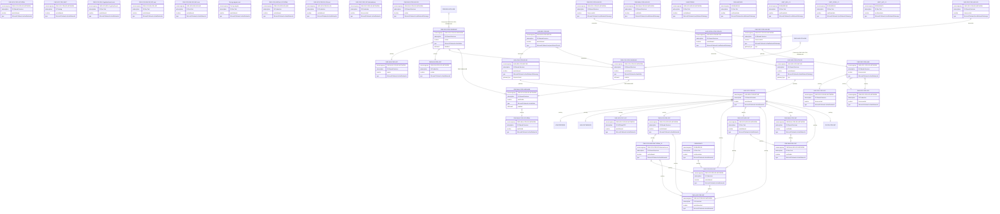

```mermaid
erDiagram
    FMG-EUS-COR-VNT {
        resourcegroup FMG-EUS-COR-RG-NETWORK
        subscription IS-Shared-Services
        location eastus
        type Microsoft-Network-virtualNetworks
    }
    FMG-EUS-COR-VWANHUB }|--|| FMG-EUS-COR-VNT : peering
    AUE-VNT-COR-001 {
        resourcegroup AUE-ARG-COR-NET-ER
        subscription IS-Shared-Services
        location australiaeast
        type Microsoft-Network-virtualNetworks
    }
    AUE-VNT-COR-001 }|--|| VNSYDPROD01 : peering
    AUE-VNT-COR-001 }|--|| AUE-VNT-WEB-001 : peering
    AUE-VNT-COR-001 }|--|| FMG-SYD-POC-VNT : peering
    AUE-VNT-COR-001 }|--|| FMG-SYD-COR-VNT : peering
    AUE-VNT-COR-001 }|--|| FMG-SYD-PRD-VNT : peering
    AUE-VNT-COR-001 }|--|| FMG-SYD-NPE-VNT : peering
    AUE-VNT-COR-001 }|--|| FMG-AUC-PRD-VNT : peering
    AUE-VNT-COR-001 }|--|| FMG-MAA-COR-VNT : peering
    AUE-VNT-COR-001 }|--|| FMG-MAA-DEV-VNT : peering
    AUE-VNT-COR-001 }|--|| FI-SYD-COR-VNT : peering
    FMG-SYD-COR-VNT-OffNet {
        resourcegroup FMG-SYD-COR-RG-NETWORK
        subscription IS-Shared-Services
        location australiaeast
        type Microsoft-Network-virtualNetworks
    }
    FMG-SYD-COR-VNT {
        resourcegroup FMG-SYD-COR-RG-NETWORK
        subscription IS-Shared-Services
        location australiaeast
        type Microsoft-Network-virtualNetworks
    }
    FMG-SYD-COR-VNT |o--o| FMG-SYD-HUB-VNET-OffNet_24 : peering
    FMG-SYD-COR-VNT |o--o| FMG-AUC-PRD-VNT : peering
    FMG-SYD-HUB-VNET-OffNet_24 {
        resourcegroup FMG-SYD-PRD-RG-RemoteAccess
        subscription IS-Shared-Services
        location australiaeast
        type Microsoft-Network-virtualNetworks
    }
    FMG-SYD-HUB-VNET-OffNet_24 |o--o| FMG-SYD-PRD-VNT : peering
    FMG-SYD-HUB-VNET-OffNet_24 |o--o| FMG-AUC-PRD-VNT : peering
    FMG-MAA-COR-VNT {
        resourcegroup FMG-MAA-COR-RG-NETWORK
        subscription IS-Shared-Services
        location southindia
        type Microsoft-Network-virtualNetworks
    }
    FMG-MAA-COR-VNT |o--o| FMG-MAA-DEV-VNT : peering
    FMG-MAA-COR-VNT-OffNet {
        resourcegroup FMG-MAA-COR-RG-NETWORK
        subscription IS-Shared-Services
        location southindia
        type Microsoft-Network-virtualNetworks
    }
    FMG-MAA-COR-VWANHUB }|--|| FMG-MAA-COR-VNT-OffNet : peering
    FMG-FRC-COR-HUB {
        resourcegroup FMG-FRC-COR-RG-NETWORK
        subscription IS-Shared-Services
        location francecentral
        type Microsoft-Network-virtualNetworks
    }
    FMG-FRC-COR-HUB }|--|| FMG-FRC-COR-VNT : peering
    FMG-FRC-COR-HUB }|--|| FMG-FRC-PRD-VNT : peering
    FMG-FRC-COR-HUB }|--|| FMG-FRC-PRD-VNT : peering
    FMG-FRC-COR-VNT {
        resourcegroup FMG-FRC-COR-RG-NETWORK
        subscription IS-Shared-Services
        location francecentral
        type Microsoft-Network-virtualNetworks
    }
    FMG-SYD-POC-VNT {
        resourcegroup FMG-SYD-POC-RG-NETWORK
        subscription IS-SAPHanaPOC
        location australiaeast
        type Microsoft-Network-virtualNetworks
    }
    FMG-SYD-TRN-VNET {
        resourcegroup FMG-SYD-TRN-RG-NETWORK
        subscription IS-Training
        location australiaeast
        type Microsoft-Network-virtualNetworks
    }
    VNSEADEV01 {
        resourcegroup RGSEADEV01
        subscription IS-Dev-Test
        location southeastasia
        type Microsoft-Network-virtualNetworks
    }
    VNSEADEV01 |o--o| FMG-SYD-PRD-VNT : peering
    FMG-SYD-DEV-CognitiveSearch-vnet {
        resourcegroup FMG-SYD-DEV-CognitiveSearch
        subscription IS-Dev-Test
        location australiaeast
        type Microsoft-Network-virtualNetworks
    }
    FMG-SYD-DEV-RG-IOP-vnet {
        resourcegroup FMG-SYD-DEV-RG-IOP
        subscription IS-Dev-Test
        location australiaeast
        type Microsoft-Network-virtualNetworks
    }
    FMG-SYD-DEV-RG-SAP-vnet {
        resourcegroup FMG-SYD-DEV-RG-SAP
        subscription IS-Dev-Test
        location australiaeast
        type Microsoft-Network-virtualNetworks
    }
    FMG-SYD-NPE-VNT {
        resourcegroup FMG-SYD-NPE-RG-NETWORK
        subscription IS-Dev-Test
        location australiaeast
        type Microsoft-Network-virtualNetworks
    }
    FMG-SYD-NPE-VNT |o--o| FMG-SYD-PRD-VNT : peering
    FMG-SYD-NPE-VNT |o--o| FMG-MAA-DEV-VNT : peering
    Test-rg-migrate-vnet {
        resourcegroup Test-rg-migrate
        subscription IS-Dev-Test
        location australiaeast
        type Microsoft-Network-virtualNetworks
    }
    FMG-MAA-DEV-VNT {
        resourcegroup FMG-MAA-DEV-RG-NETWORK
        subscription IS-Dev-Test
        location southindia
        type Microsoft-Network-virtualNetworks
    }
    FMG-EUS-PRD-VNT {
        resourcegroup FMG-EUS-PRD-RG-NETWORK
        subscription IS-Production
        location eastus
        type Microsoft-Network-virtualNetworks
    }
    FMG-EUS-COR-VWANHUB }|--|| FMG-EUS-PRD-VNT : peering
    FMG-SYD-ASRTest-VNT-OffNet {
        resourcegroup FMG-SYD-PRD-RG-ASR
        subscription IS-Production
        location australiaeast
        type Microsoft-Network-virtualNetworks
    }
    FMG-SYD-PRD-VNT {
        resourcegroup FMG-SYD-PRD-RG-NETWORK
        subscription IS-Production
        location australiaeast
        type Microsoft-Network-virtualNetworks
    }
    FMG-SYD-PRD-VNT |o--o| FMG-AUC-PRD-VNT : peering
    FMG-SYD-PRD-RG-VDI-vnet {
        resourcegroup FMG-SYD-PRD-RG-VDI
        subscription IS-Production
        location australiaeast
        type Microsoft-Network-virtualNetworks
    }
    FMG-FRC-PRD-VNT {
        resourcegroup FMG-FRC-PRD-RG-NETWORK
        subscription IS-Production
        location francecentral
        type Microsoft-Network-virtualNetworks
    }
    FMG-FRC-PRD-VNT-Workstations {
        resourcegroup FMG-FRC-PRD-RG-NETWORK
        subscription IS-Production
        location francecentral
        type Microsoft-Network-virtualNetworks
    }
    FMG-AUC-PRD-VNT {
        resourcegroup FMG-AUC-PRD-RG-NETWORK
        subscription IS-Production
        location australiacentral
        type Microsoft-Network-virtualNetworks
    }
    AUE-ERC-COR-001 {
        resourcegroup AUE-ARG-COR-NET-ER
        subscription IS-Shared-Services
        location australiaeast
        type Microsoft-Network-expressRouteCircuits
    }
    AUE-LOCAL-COR-VPN-001 {
        resourcegroup AUE-ARG-COR-NET-ER
        subscription IS-Shared-Services
        location australiaeast
        type Microsoft-Network-localNetworkGateways
    }
    FMG-EUS-COR-LNG-001 {
        resourcegroup FMG-EUS-COR-RG-NETWORK
        subscription IS-Shared-Services
        location eastus
        type Microsoft-Network-localNetworkGateways
    }
    FMG-FRC-COR-LNG-001 {
        resourcegroup FMG-FRC-COR-RG-NETWORK
        subscription IS-Shared-Services
        location francecentral
        type Microsoft-Network-localNetworkGateways
    }
    FMG-FRC-POR-LNG-001 {
        resourcegroup FMG-FRC-COR-RG-NETWORK
        subscription IS-Shared-Services
        location francecentral
        type Microsoft-Network-localNetworkGateways
    }
    FMG-MAA-COR-LNG-001 {
        resourcegroup FMG-MAA-COR-RG-NETWORK
        subscription IS-Shared-Services
        location southindia
        type Microsoft-Network-localNetworkGateways
    }
    LNGWTOFMG {
        resourcegroup FMG-SYD-NPE-RG-NETWORK
        subscription IS-Dev-Test
        location australiaeast
        type Microsoft-Network-localNetworkGateways
    }
    FMGLANPROD {
        resourcegroup RGSEADEV01
        subscription IS-Dev-Test
        location southeastasia
        type Microsoft-Network-localNetworkGateways
    }
    VNET_DEV_V1 {
        resourcegroup RGSEADEV01
        subscription IS-Dev-Test
        location southeastasia
        type Microsoft-Network-localNetworkGateways
    }
    VNET_PROD_V1 {
        resourcegroup RGSEADEV01
        subscription IS-Dev-Test
        location southeastasia
        type Microsoft-Network-localNetworkGateways
    }
    VNET_UAT_V1 {
        resourcegroup RGSEADEV01
        subscription IS-Dev-Test
        location southeastasia
        type Microsoft-Network-localNetworkGateways
    }
    AUE-VNG-COR-ER-001 {
        resourcegroup AUE-ARG-COR-NET-ER
        subscription IS-Shared-Services
        location australiaeast
        type Microsoft-Network-virtualNetworkGateways
        gatewayType ExpressRoute
    }
    AUE-VNG-COR-ER-001 ||--|| AUE-VNT-COR-001 : gateway
    AUE-VNG-COR-VPN-001 {
        resourcegroup AUE-ARG-COR-NET-ER
        subscription IS-Shared-Services
        location australiaeast
        type Microsoft-Network-virtualNetworkGateways
        gatewayType Vpn
    }
    AUE-VNG-COR-VPN-001 ||--|| AUE-VNT-COR-001 : gateway
    FMG-FRC-COR-VNG-001 {
        resourcegroup FMG-FRC-COR-RG-NETWORK
        subscription IS-Shared-Services
        location francecentral
        type Microsoft-Network-virtualNetworkGateways
        gatewayType Vpn
    }
    FMG-FRC-COR-VNG-001 ||--|| FMG-FRC-COR-HUB : gateway
    AUE-ERC-COR-001 ||--|| AUE-VNG-COR-ER-001 : connection
    AUE-LOCAL-COR-VPN-001 ||--|| AUE-VNG-COR-VPN-001 : connection
    FMG-FRC-COR-LNG-001 ||--|| FMG-FRC-COR-VNG-001 : connection
    FMG-FRC-POR-LNG-001 ||--|| FMG-FRC-COR-VNG-001 : connection
    FMG-EUS-COR-VWANHUB {
        resourcegroup FMG-SYD-COR-RG-NETWORK
        subscription IS-Shared-Services
        location eastus
        type Microsoft-Network-virtualHubs
        azfirewall disabled
    }
    FMG-EUS-VPN-LINK }|--|{ FMG-EUS-COR-VWANHUB : Connection-FMG-EUS-COR-PRISMA-001
    FMG-SYD-COR-VWANHUB {
        resourcegroup FMG-SYD-COR-RG-NETWORK
        subscription IS-Shared-Services
        location australiaeast
        type Microsoft-Network-virtualHubs
        azfirewall enabled
    }
    FMG-EUS-COR-VWANHUB }|--|{ FMG-SYD-COR-VWANHUB : FMG-VWAN-HUB
    FMG-AUE-VPN-LINK }|--|{ FMG-SYD-COR-VWANHUB : Connection-FMG-AUE-COR-PRISMA-001
    AUE-ERC-COR-001 }|--|{ FMG-SYD-COR-VWANHUB : connection
    FMG-MAA-COR-VWANHUB {
        resourcegroup FMG-SYD-COR-RG-NETWORK
        subscription IS-Shared-Services
        location southindia
        type Microsoft-Network-virtualHubs
        azfirewall enabled
    }
    FMG-EUS-COR-VWANHUB }|--|{ FMG-MAA-COR-VWANHUB : FMG-VWAN-HUB
    FMG-SYD-COR-VWANHUB }|--|{ FMG-MAA-COR-VWANHUB : FMG-VWAN-HUB
```